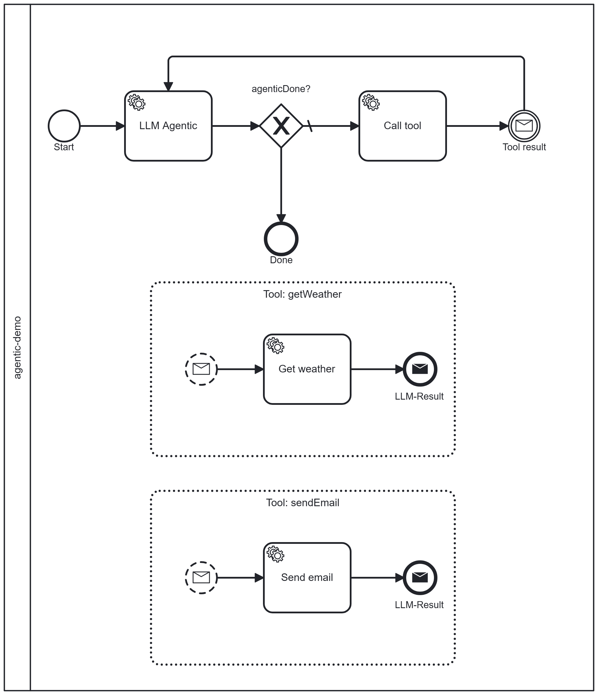

# camunda7-agentic-examples

Runnable, end-to-end examples for the
[`camunda7-agentic-starter`](https://github.com/NFehringVHV/camunda7-agentic-starter): an LLM-driven **agentic tool-calling
loop** on top of [Camunda 7](https://docs.camunda.org/manual/7.24/).

Two modules that run side by side:

| Module | What it is | Spring Boot | Port |
| --- | --- | --- | --- |
| [`example-process`](example-process) | Embedded Camunda 7 engine + REST/Webapp that deploys the `agentic-demo` process and its tool delegates. | 3.3.5 | 8080 |
| [`example-worker`](example-worker) | Standalone Spring Boot app that adds the starter + **AWS Bedrock** (Spring AI) and runs the agentic external-task workers. | 4.x | (client) |

> **Why is `example-process` on Spring Boot 3 while everything else is on 4?** `example-process`
> embeds the Camunda 7 engine via the **community** `camunda-bpm-spring-boot-starter-rest`/`-webapp`
> (7.24), which is **not compatible with Spring Boot 4** — a Boot 4 context fails to start (e.g.
> `CamundaBpmAutoConfiguration` bean errors). Spring Boot 4 support for the embedded engine exists
> only in the Camunda **Enterprise** edition (7.24.3-ee+). The `camunda7-agentic-starter` and
> `example-worker` do **not** embed the engine (they only use the external-task client + BPMN model),
> so they run on Spring Boot 4 without issue. If/when a Boot-4-capable community engine (or Camunda 8)
> is targeted, this module can be raised too.

The two run as **separate processes**: `example-worker` connects to `example-process` over the
Camunda REST API (`http://localhost:8080/engine-rest`) and drives the loop. This mirrors a real
deployment where the engine and the LLM worker are independent services.

> `example-worker` uses AWS Bedrock only to demonstrate the "bring your own provider" model. Swap
> the `spring-ai-starter-model-bedrock-converse` dependency for any other Spring AI model starter
> (OpenAI, Azure, Ollama, …) to use a different provider — the starter itself is provider-neutral.

---

## The demo process



`agentic-demo` (in `example-process/src/main/resources/processes/agentic-demo.bpmn`) exposes two
tools as BPMN event sub-processes:

- **`getWeather`** — returns weather for a `location` (handled by `GetWeatherDelegate`).
- **`sendEmail`** — pretends to send an email (handled by `SendEmailDelegate`).

Given a `userPrompt`, the LLM decides which tool(s) to call, in which order, and when it is done.

> **Note.** The tool delegates deliberately sleep for a few seconds. This simulates a real tool
> calling a slower downstream system and, as a side effect, guarantees the main flow is already
> waiting at the `LLM-Result` catch before the tool signals its result back — see the *Known
> limitation — correlation timing* note in the starter's
> [Tool convention](https://github.com/NFehringVHV/camunda7-agentic-starter#tool-convention).

---

## Prerequisites

- Java 21+, Maven.
- AWS credentials with access to a Bedrock Converse-capable model, provided the standard AWS way
  (environment variables, a shared profile, or an IAM role). **Never commit credentials.**

## 1. Build

```bash
mvn verify
```

This also builds/installs nothing external — but note `example-worker` depends on
`io.github.camunda7-agentic:camunda7-agentic-starter`, so build/install the starter first if you
have not published it:

```bash
cd ../camunda7-agentic-starter && mvn install
```

## 2. Start the engine (`example-process`)

```bash
cd example-process
mvn spring-boot:run
```

- REST API: <http://localhost:8080/engine-rest>
- Webapp (Cockpit/Tasklist), user `demo` / `demo`: <http://localhost:8080/camunda>

## 3. Start the worker (`example-worker`)

The Bedrock client resolves credentials via the standard AWS provider chain, so any of the
following work. **Never commit credentials.**

**a) Environment variables (simplest)** — in a second terminal:

```bash
cd example-worker
export AWS_ACCESS_KEY_ID=AKIA...
export AWS_SECRET_ACCESS_KEY=...
export AWS_SESSION_TOKEN=...            # only for temporary credentials
export AWS_REGION=eu-central-1
export BEDROCK_MODEL='eu.anthropic.claude-sonnet-4-6'   # a model your account can use
mvn spring-boot:run
```

On Windows PowerShell use `$env:AWS_ACCESS_KEY_ID='AKIA...'` etc.

**b) A shared profile or IAM role** — set nothing; the default chain picks up
`~/.aws/credentials` / `~/.aws/config` (optionally `AWS_PROFILE=myprofile`) or the instance role.

**c) Explicit `-D` system properties.** These bind to the Spring AI Bedrock config keys. Note that
`mvn spring-boot:run` forks a new JVM, so plain `-D` on the `mvn` line is **not** forwarded — pass
them through `spring-boot.run.jvmArguments`:

```bash
mvn spring-boot:run -Dspring-boot.run.jvmArguments="\
  -Dspring.ai.bedrock.aws.region=eu-central-1 \
  -Dspring.ai.bedrock.aws.access-key=AKIA... \
  -Dspring.ai.bedrock.aws.secret-key=... \
  -Dspring.ai.bedrock.aws.session-token=..."
```

Or run the built jar, where plain `-D` reaches the app directly:

```bash
mvn -q -DskipTests package
java -Dspring.ai.bedrock.aws.region=eu-central-1 \
     -Dspring.ai.bedrock.aws.access-key=AKIA... \
     -Dspring.ai.bedrock.aws.secret-key=... \
     -jar target/example-worker-0.1.0-SNAPSHOT.jar
```

The property keys are: `spring.ai.bedrock.aws.region`, `spring.ai.bedrock.aws.access-key`,
`spring.ai.bedrock.aws.secret-key`, `spring.ai.bedrock.aws.session-token` (and the model id at
`spring.ai.bedrock.converse.chat.options.model`). System properties override
`application.yml`, which in turn falls back to the `AWS_*` environment variables shown above.

Relevant settings live in `example-worker/src/main/resources/application.yml` (Bedrock model,
Camunda REST URL, history store).

## 4. Start a process instance

Start `agentic-demo` with a `userPrompt`, e.g. via the Camunda REST API:

```bash
curl -u demo:demo -H "Content-Type: application/json" \
  -d '{"variables":{"userPrompt":{"value":"What is the weather in Berlin? If it is nice, email alice@example.com about a picnic.","type":"String"}}}' \
  http://localhost:8080/engine-rest/process-definition/key/agentic-demo/start
```

Watch the worker log and Cockpit: the LLM will call `getWeather`, then (optionally) `sendEmail`,
and finish with `agenticFinalAnswer` set on the instance.

---

## License

Apache-2.0 — see [LICENSE](LICENSE). Contributions: see [CONTRIBUTING.md](CONTRIBUTING.md);
security reports: see [SECURITY.md](SECURITY.md).
